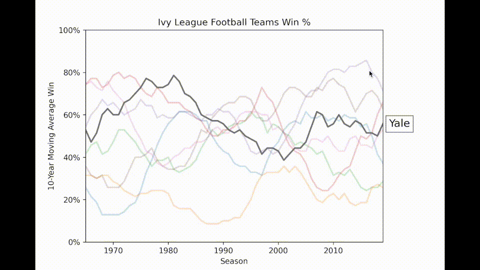

# Ivy League Football

I used Jupyter notebook for this project. Run the `ipynb` file locally to interact with the figure or see the `html` file to see the static version of it.

## Overview
This is mainly a data cleaning and visualization project. I scraped Ivy League football game data from Wikipedia using the `BeautifulSoup` package, and then made an interactive figure to visualize the 10-year moving average win percentage of each college. I defined the pick event (click using cursor) in a function `on_pick`, and connected the pick event to the figure canvas to make the figure interactive. 

Readers can select a line in the figure, which will then be highlighted and labeled. The details are documented along with the code in the Jupyter notebook file. Following is a sample of the visualization.

